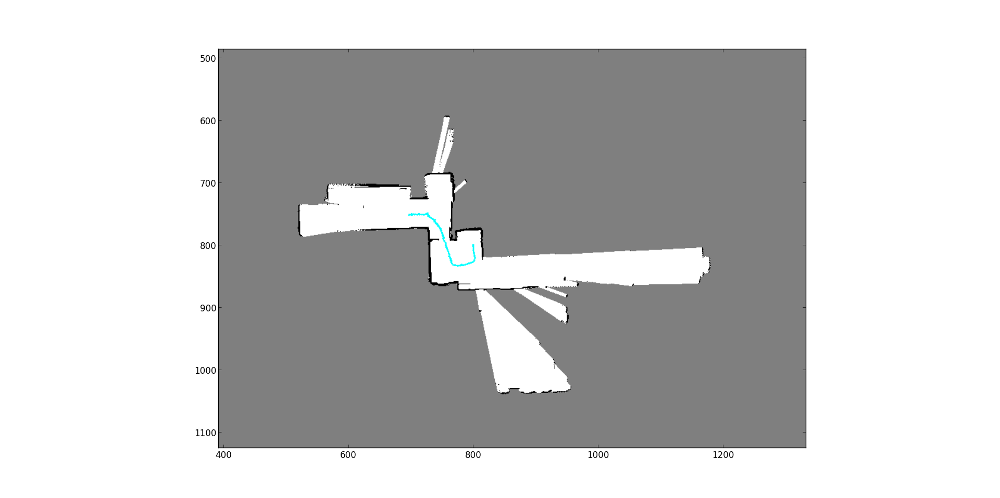

# Fast SLAM based on Particle Filter

The package creates Fast SLAM algorithm based on the particle filter. Finally, it can implement the structure of mapping and           localization in an indoor environment using information from an IMU and range sensors.       

The main algorithm refers to this tutorial slides: [A tutorial on fast slam](http://ais.informatik.uni-freiburg.de/teaching/ws12/mapping/pdf/slam10-fastslam-4.pdf).

Algorithm
---------
1. First, integrate the IMU orientation and odometry information from a walking humanoid with a 2D laser range scanner (LIDAR) in order to build a 2D occupancy grid map of the walls and obstacles in the environment.          
2. After this, integrate additional camera and depth imagery from a Kinect One sensor to build atextured map.      

In summary, we will first implement 2D localization and mapping system before moving on to the RGBD part. Training sets of odometry, inertial, and range measurements from a THOR-OP humanoid robot will be provided for this project.         

Data
-----
All data are collected using IMU sensor, LIDAR laser scan and Kinect One sensor. 

Two types dataset in the package:     
1. _Train_: contains all training data, each data file **train_joint#.mat** includes robot odometry, laser scan and RGBD image frame information.
2. _cameraParam_: tell the intrinsic matrix information of the Kinect camera (focal length, principle points and scale factor).      

Execution
---------
1. _SLAM: the main training file to localize robot and map 2D space.
2. _TextureMap.py_: contains the algorithm for texture map construction to build 3D map.
3. _load_data.py_: data loader.
4. _utils.py_: helper functions including save, loading data and k-means.
5. _MapUtils.py_: build 2D grid map enviornment.

Add the package to your own workspace, execute the 'SLAM.py' directly, you are supposed tp see a figure on the screen which can show the mapping process. _However_, Due to the capacity of training data, it might take some time to show only one step update. Such that you can add some intervals to skip some frames, in order to see somehow significant mapping and localization process.

Locate at line 112, 'SLAM.py', follow below operation:     
change
~~~~
for i in range(1, timeline): 
~~~~
to
~~~~
for i in range(1, timeline, <interval, e.g.25>)
~~~~

Results and Report
-------
Four generated 2D maps are in the _result_ folder. For each map,       
1. _white region_: explored empty space.
2. _black edge lines_: explored occupied space (e.g. wall, chair, human).
3. _gray space_: un-scanned space.
4. _blue curve_: the trajectory of robot.      

Below shows one sample test results

  

In addition, you can check the report _Report.pdf_ for more detailed explanantions.
