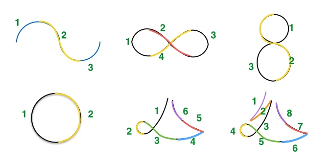
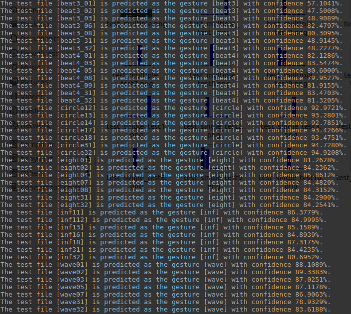

# Gesture Recoginition using Hidden Markov Model (HMM)

The package creates an algorithm based on the HMM to recognize different robot arm motion gestures. Finally, it can achieve the ability to classify unknown arm motions in real-time.       

The HMM algorithm refers to this tutorial paper: [A tutorial on Hidden Markov Models and Selected Applications in Speech Recognition](http://www.ece.ucsb.edu/Faculty/Rabiner/ece259/Reprints/tutorial%20on%20hmm%20and%20applications.pdf).

Data
-----
All data are collected using IMU sensor reading from gyroscopes and accelerometers that describe the arm motions associated with the movements. The datasets were collected from a consumer mobile device so there is no need to consider bias or sensitivity issues. The data format as(**7d vector**): [ts, Ax, Ay, Az, Wx, Wy, Wz].      

Below figure shows the six different motions(1.Wave; 2.Infinity; 3.Eight; 4.Circle; 5.Beat3; 6.Beat4)

  

Total three datasets in the package:     
1. _train_: contains all training data.
2. _test_single_: contains test dataset using single step motion for each gesture.
3. _test_multiple_: contains test dataset using multiple steps motion for each gesture.

Execution
---------
1. _training.py_: the main training file to train the HMM model for each gesture type.
2. _hmm.py_: the general HMM model.
3. _Classification.py_: the test file.
4. _utils.py_: helper functions including save, loading data and k-means.

Results and Report
-------
1. _hmm_trained_models_: contains all trained models as well as k-means clustered results.
2. _hmm_test_res_: contains all test results figures to show the prediction type with corresponding confidence.

_Training Results_

  

Please feel free to execute the file _Classification.py_ to see more intuitive test results.

In addition, you can check the report _GestureRecoHMM_report.pdf_ for more detailed explanantions.
