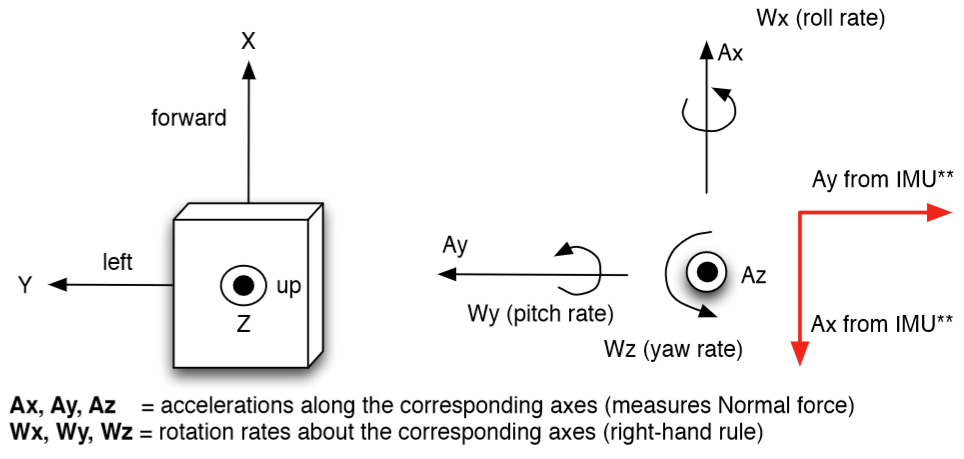
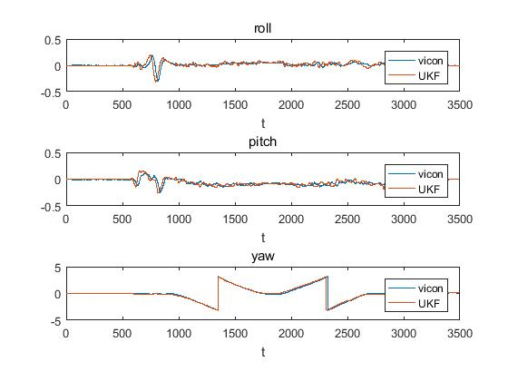

# Orientation Estimation using Unscented Kalman Filter(UKF)

This package implements a Kalman filter to track three dimensional orientation of a hand-handled camera. Given IMU sensor readings from gyroscopes and accelerometers, the algorithm will estimate the underlying 3D orientation by learning the appropriate model parameters from ground truth data given by a Vicon motion capture system. Then it's able to generate a real-time panoramic image from camera images using the 3D orientation filter.       

The main UKF algorithm refers to this paper: [A Quaternion-based Unscented Kalman Filter for Orientation Tracking](http://ieeexplore.ieee.org/stamp/stamp.jsp?arnumber=1257247).

Data
-----
All data are collected using IMU sensor reading from gyroscopes and accelerometers that describe the arm motions associated with the movements. Those data are in raw version such that it's necessary to consider bias or sensitivity issues. The data format as(**6d vector**): [Ax, Ay, Az, Wz, Wx, Wy].      

Below figure shows the more intuitive camera frame model:     

  

      

Total three datasets in the package:     
1. _imu_: contains all training data.
2. _test_: contains all test data.
3. _vicon_: contains ground truth data.        

Moreover, feel free to check the documentation: _IMU_reference.pdf_ for more detailed collected data information.     

Execution
---------
1. _UKF.py_: the main training file to estimate the camera pose.
2. _ADC.py_: works as dataloader and clean up raw data.
3. _quaternions.py_: contains all basic operations of quaternions (including the average value estimation algorithm).
4. _display.py_: plot helper function.
5. _img_stitch.py_: generate panorama given camera pose information and images. (**Optional**: I also provide the matlab image stitching version, _'img_stitch.m'_, which is much faster).         

For each test IMU data, you are supposed to see a figure display on the screen to show the filtered result in roll, pitch and yaw three dimension. Once you close the figure, it will work on the next coming test data in the target folder automatically. 

Results and Report
-------
All results are stored in the folder **_result_**, including:

**_3D Orientation Estimation_**

  

**_Generated Panorama_** 

   

**_Real-time Panorama Generating Video_**         
The video is [here](https://drive.google.com/open?id=0B-YfsvV6PlJRaEtVb0pjTnNSaE0).

In addition, you can check the report **_Report.pdf_** for more detailed explanantions.
