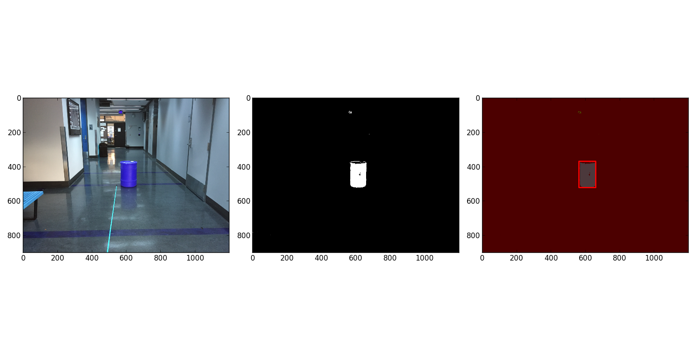

# Object Detection (Red Barrel) using Gaussian Mixture Model

In this package, it trains a probabilistic color model from image data, which will be used to segment and detect a target of interest (red barrel), and find the relative world coordinates of the target with respect to the camera frame.          

More specifically, given a set of training images, hand-label examples of different colors first. Then from these training examples, build color classifiers for several colors (e.g., red, yellow, brown, etc.) and finally a red barrel detector. After detection, use own designed algorithm to obtain the bounding box of a detected barrel in the image frame and use the camera parameters to calculate the distance to the barrel on a set of new test images.        

The main GMM algorithm refers to this tutorial paper: [Mixture Model and EM](http://www.cse.psu.edu/~rtc12/CSE586Spring2010/papers/prmlMixturesEM.pdf).

Algorithm and Tips
------------------
1. **_Hand-label appropriate regions in the training images with discrete color labels_**                   
For this project, we will be especially interested in regions containing the red barrel (positive examples) and images containing similar colored-areas that are not a barrel (negative examples). If you are more ambitious, you could try to implement more automated ways of labeling images, e.g., by an unsupervised image segmentation, or an adaptive region flooding algorithm. Lighting invariance will be an issue, so you should think carefully about the best color space to use, and perhaps some low-level adaptation on the image.        
2. **_Use a learning algorithm to partition the color space into appropriate class color regions_**           
In this project, we use Gaussain Mixture Model(GMM) to repersent each possible color region, but you are also free to try other machine learning approaches if you are interested in, e.g., decision trees, support vector machines, etc. You need to make your algorithm so that it is able to robustly generalize to new images. To prevent overfitting the training images, split them into training and validation sets. Train your algorithms using the training set and evaluate their performance on the validation set. This will allow you to compare different parameters for the probabilistic models and different color space representations.          

3. **_Geometric Distance Estimation_**           
Once the color regions are identified, we use shape statistics and other higher-level features to decide where the barrel is located in the images. Use designed algorithms (e.g., camera model) to identify the coordinates of a bounding box for each detected barrel, which should compute an estimate of the distance to the barrel.        

Data
-----
All training data are images that contain at least one red barrel, some of them may only include red barrel without any other confusing red color, and some may contain more than one similar red color. Part of training examples are shown below:

<align="left">
  
<align="center">
  
<align="right">
  

Typically, for each train image, we manually crop and label red barrel data, as well as other interest color, and then store them as _.npy_ format. Total four dataset types in the package:     
1. _red_barrel_: images used for training red color model from red barrel.
2. _red_chair_: images used for training red color model from red chair.
3. _other_red1/2_: images used for training red color model from other red objects.    

Corresponding trained GMMs:
1. _GMM_redBarrel_: model of red barrel.
2. _GMM_redChair_: model of red chairs.
3. _GMM_redOther1_: model of part of other red objects, including red robotics, red wall.
4. _GMM_redOther2_: model of part of other red objects, including red ball and red bicycle.

Execution
---------
1. `main_code.py`: the main algorithm to achieve object detection and distance estimation.
2. `TrainGMM.py`: the algorithm to train GMM using EM.
3. `TrainGM.py`: the algorithm to build GM.
4. `Hand_label.py`: the algorithm to label ROI manually and store in _.npy_ format.

Feel free to run the `_main_code.py_` directly for testing images. It's recommended to put all test images in the same directory and then change to the corresponding path name in `_main_code.py_`.        

For each test image, you are supposed to see a figure shown in the screen which contains total three plots:      
1. The original image (color converted);
2. All detected region candidates;
3. Contours of red barrel.        

Then once you close the figure, the terminal will show the number of detected red barrel, four corresponding corner positions and distance information. 

Results and Report
-------
Feel free to check all trained/test results in the **_Report.pdf_**, below shows a simple demo result:

**_Detection Result_**

  

